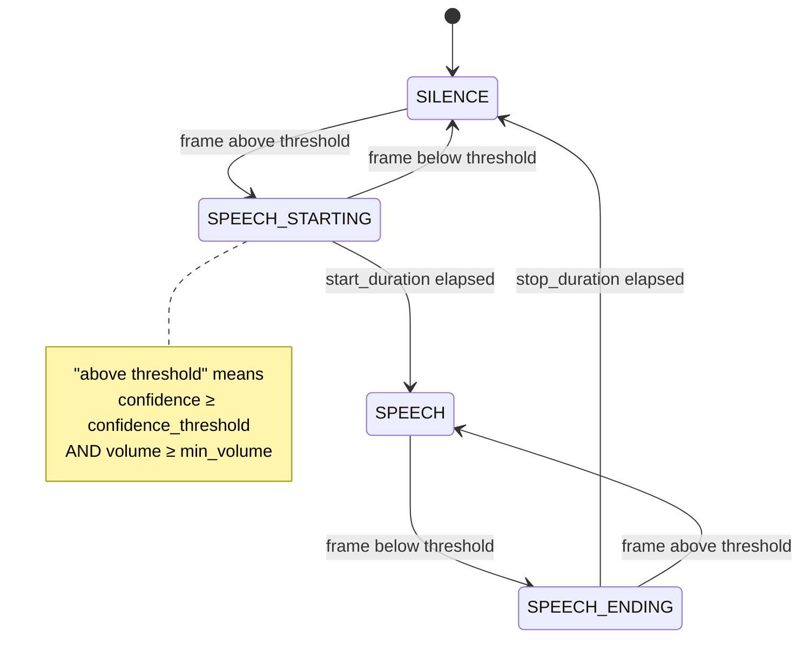
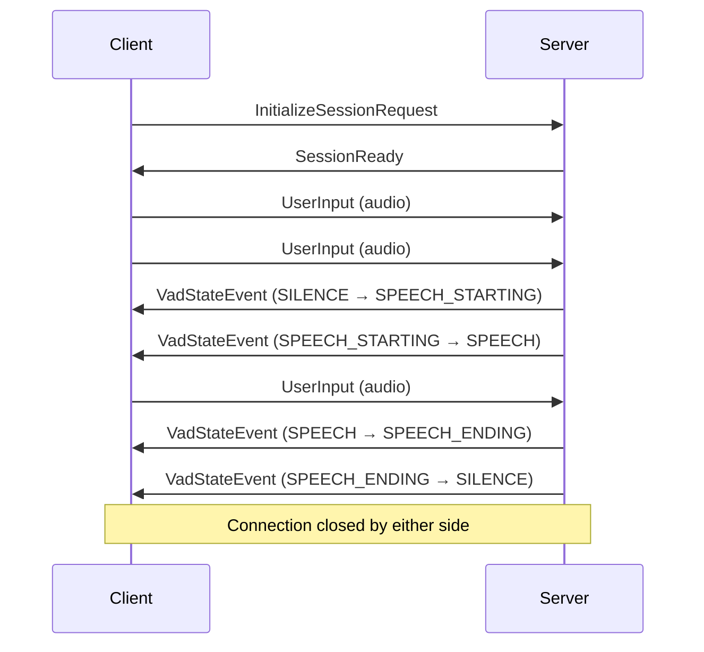

The VAD WebSocket Protocol is a lightweight streaming endpoint for Voice Activity Detection without LLM inference. It uses Protocol Buffers for message encoding. All messages are wrapped in either `ServiceBoundMessage` (client to server) or `ClientBoundMessage` (server to client).

<Note>
Messages are binary-encoded protobuf. JSON examples below are shown for readability. [Download the proto file](https://raw.githubusercontent.com/deepslate-labs/deepslate-docs/refs/heads/main/api-reference/vad.proto).
</Note>

<Info>
This endpoint runs pure VAD — it does **not** perform LLM inference, TTS synthesis, or transcription. Use it when you only need speech activity events and want to drive your own processing pipeline downstream. For the full conversational AI pipeline, see the [Opal WebSocket Protocol](/api-reference/realtime).
</Info>

## Connection

```
wss://app.deepslate.eu/api/v1/vendors/{vendorId}/organizations/{organizationId}/realtime/vad
```

Authentication via Bearer token in the connection headers.

---

## Client Messages

Messages sent from client to server, wrapped in `ServiceBoundMessage`.

<AccordionGroup>
  <Accordion title="InitializeSessionRequest" icon="play" defaultOpen>
    **Must be the first message sent.** Configures the audio input format and VAD parameters.

    <Note>
    Inference, TTS, and playback reporting fields from the full realtime protocol are not used here and will be ignored if present.
    </Note>

    | Field | Type | Description |
    |-------|------|-------------|
    | `input_audio_line` | AudioLineConfiguration | Input audio format configuration |
    | `output_audio_line` | AudioLineConfiguration | Output audio format (reserved for symmetry; not actively used) |
    | `vad_configuration` | VadConfiguration | Voice activity detection settings |
    | `enable_vad_frame_telemetry` | bool | When `true`, the server emits per-frame `VadAnalysisFrame` messages (~50 Hz). Off by default. **Experimental.** |

    ```json
    {
      "initializeSessionRequest": {
        "inputAudioLine": {
          "sampleRate": 16000,
          "channelCount": 1,
          "sampleFormat": "SIGNED_16_BIT"
        },
        "vadConfiguration": {
          "confidenceThreshold": 0.5,
          "minVolume": 0,
          "startDuration": { "seconds": 0, "nanos": 200000000 },
          "stopDuration": { "seconds": 0, "nanos": 500000000 },
          "backbufferDuration": { "seconds": 1, "nanos": 0 }
        },
        "enableVadFrameTelemetry": false
      }
    }
    ```
  </Accordion>

  <Accordion title="ReconfigureSessionRequest" icon="gear">
    Reconfigure the input audio format of an ongoing session.

    <Warning>
    Reconfiguration may not be seamless. There may be glitches or dropped audio during the transition.
    </Warning>

    | Field | Type | Description |
    |-------|------|-------------|
    | `input_audio_line` | AudioLineConfiguration | Updated input audio format configuration |

    ```json
    {
      "reconfigureSessionRequest": {
        "inputAudioLine": {
          "sampleRate": 48000,
          "channelCount": 1,
          "sampleFormat": "SIGNED_16_BIT"
        }
      }
    }
    ```
  </Accordion>

  <Accordion title="UserInput" icon="microphone">
    Raw PCM audio input for VAD processing. Only audio data is accepted — text input and inference trigger modes are not supported on this endpoint.

    | Field | Type | Description |
    |-------|------|-------------|
    | `packet_id` | uint64 | Client-defined packet identifier. Used to correlate packets with VAD events (e.g. `VadStateEvent.packet_id`). Any numbering scheme is valid. |
    | `audio_data` | AudioData | Raw PCM audio bytes matching the configured `input_audio_line` |

    ```json
    {
      "userInput": {
        "packetId": 42,
        "audioData": {
          "data": "<binary-pcm-data>"
        }
      }
    }
    ```
  </Accordion>
</AccordionGroup>

---

## Server Messages

Messages sent from server to client, wrapped in `ClientBoundMessage`.

<AccordionGroup>
  <Accordion title="SessionReady" icon="circle-check" defaultOpen>
    Sent once the session is fully initialized and ready to accept audio input. Wait for this message before sending `UserInput`.

    ```json
    {
      "sessionReady": {}
    }
    ```
  </Accordion>

  <Accordion title="VadStateEvent" icon="wave-square">
    Emitted on every VAD state-machine transition. Always sent, regardless of whether `enable_vad_frame_telemetry` is set.

    | Field | Type | Description |
    |-------|------|-------------|
    | `session_time` | Duration | Time elapsed since the input pipeline started when the transition occurred |
    | `from_state` | VadState | The state before the transition |
    | `to_state` | VadState | The state after the transition |
    | `packet_id` | uint64 | The `packet_id` of the `UserInput` packet that triggered the transition |

    ```json
    {
      "vadStateEvent": {
        "sessionTime": { "seconds": 2, "nanos": 340000000 },
        "fromState": "SILENCE",
        "toState": "SPEECH_STARTING",
        "packetId": 42
      }
    }
    ```
  </Accordion>

  <Accordion title="VadAnalysisFrame" icon="chart-waveform">
    Per-frame VAD telemetry, emitted at ~50 Hz (20 ms frames on 16 kHz audio). Only sent when `enable_vad_frame_telemetry: true` was set in `InitializeSessionRequest`.

    <Warning>
    This message type is **experimental** and may be changed or removed without a major version bump.
    </Warning>

    Frame indexing is monotonic per session and reflects the post-resampling frame stream that the VAD engine actually processes.

    | Field | Type | Description |
    |-------|------|-------------|
    | `frame_index` | uint64 | Monotonic frame index for this session |
    | `session_time` | Duration | Wall-clock time elapsed since the input pipeline started, at the end of this frame |
    | `confidence` | float | Raw VAD confidence score from the underlying engine (0.0–1.0) |
    | `volume` | float | Raw RMS volume of the audio frame (0.0–1.0) |
    | `state` | VadState | The state-machine state at the **end** of this frame |
    | `source_packet_ids` | uint64[] | `packet_id`s whose audio contributed to this frame. Usually one; multiple at packet boundaries or with very small packets. |

    ```json
    {
      "vadAnalysisFrame": {
        "frameIndex": 117,
        "sessionTime": { "seconds": 2, "nanos": 340000000 },
        "confidence": 0.82,
        "volume": 0.31,
        "state": "SPEECH",
        "sourcePacketIds": [42]
      }
    }
    ```
  </Accordion>

  <Accordion title="SessionErrorNotification" icon="triangle-exclamation">
    Structured error notification sent before the server closes the connection.

    | Field | Type | Description |
    |-------|------|-------------|
    | `category` | SessionErrorCategory | Error category for programmatic handling |
    | `message` | string | Human-readable message for logging or display |
    | `trace_id` | string | Optional trace ID for correlating with server logs |

    ```json
    {
      "error": {
        "category": "ERROR_CONFIGURATION",
        "message": "Invalid sample rate: must be between 8000 and 48000",
        "traceId": "abc-123-xyz"
      }
    }
    ```
  </Accordion>
</AccordionGroup>

---

## Type Definitions

### AudioLineConfiguration

| Field | Type | Description |
|-------|------|-------------|
| `sample_rate` | uint32 | Sample rate in Hz (e.g., 16000) |
| `channel_count` | uint32 | Number of channels (typically 1 for mono) |
| `sample_format` | SampleFormat | Audio sample format |

### SampleFormat

| Value | Description |
|-------|-------------|
| `UNSIGNED_8_BIT` | 8-bit unsigned integer samples |
| `SIGNED_16_BIT` | 16-bit signed integer samples (recommended) |
| `SIGNED_32_BIT` | 32-bit signed integer samples |
| `FLOAT_32_BIT` | 32-bit floating point (0.0 to 1.0) |
| `FLOAT_64_BIT` | 64-bit floating point (0.0 to 1.0) |

### VadConfiguration

Voice Activity Detection settings.

| Field | Type | Description |
|-------|------|-------------|
| `confidence_threshold` | float | Min confidence for speech detection (0.0–1.0) |
| `min_volume` | float | Min volume level for speech (0.0–1.0) |
| `start_duration` | Duration | How long speech must be detected continuously before triggering `SPEECH_STARTING` |
| `stop_duration` | Duration | How long silence must persist before transitioning out of `SPEECH` |
| `backbuffer_duration` | Duration | Audio buffered before the speech start point (recommended: 1 s) |

### VadState

The VAD pipeline is a debounced state machine. Rather than emitting a transition on every raw frame, the engine applies `start_duration` and `stop_duration` windows to smooth out transient noise and brief pauses before committing to a new state. A frame is considered **above threshold** when both `confidence ≥ confidence_threshold` AND `volume ≥ min_volume`; both conditions must hold simultaneously.



**`SILENCE`** — The initial state. The engine is processing audio but no speech onset has been detected. Frames are evaluated every ~20 ms; the machine stays here until it sees a frame that clears both `confidence_threshold` and `min_volume`.

**`SPEECH_STARTING`** — A potential speech onset has been detected: at least one frame exceeded both thresholds. The machine enters this state and starts the `start_duration` debounce timer. This window guards against brief noise bursts or transient spikes being misclassified as speech. Two outcomes are possible:
- If frames remain above threshold continuously for the full `start_duration`, the machine advances to `SPEECH`.
- If any frame drops below threshold before `start_duration` elapses, the machine returns to `SILENCE` immediately — the onset is treated as a false positive.

**`SPEECH`** — Active speech is confirmed. The machine entered here after sustained above-threshold audio lasting at least `start_duration`. Audio is considered live speech until the engine sees a frame that drops below threshold, at which point the machine moves to `SPEECH_ENDING`.

**`SPEECH_ENDING`** — A potential speech offset has been detected: a frame dropped below threshold while in `SPEECH`. The `stop_duration` debounce timer starts. This window prevents brief pauses — breaths, hesitations, word gaps — from prematurely ending a speech segment. Two outcomes are possible:
- If any frame returns above threshold before `stop_duration` elapses, the machine snaps back to `SPEECH`, continuing the same segment.
- If frames remain below threshold for the full `stop_duration`, the machine transitions to `SILENCE` and the speech segment is considered complete.

| Value | Description |
|-------|-------------|
| `SILENCE` | No speech detected |
| `SPEECH_STARTING` | Above-threshold frame seen; waiting for `start_duration` to confirm onset |
| `SPEECH` | Active speech confirmed |
| `SPEECH_ENDING` | Below-threshold frame seen; waiting for `stop_duration` to confirm offset |

### Duration

| Field | Type | Description |
|-------|------|-------------|
| `seconds` | uint64 | Whole seconds |
| `nanos` | uint32 | Nanoseconds component |

```json
// 200 milliseconds
{ "seconds": 0, "nanos": 200000000 }

// 1 second
{ "seconds": 1, "nanos": 0 }
```

### SessionErrorCategory

| Value | Description |
|-------|-------------|
| `ERROR_UNKNOWN` | Unknown or unclassified error |
| `ERROR_SESSION` | Session lifecycle errors (not initialized, already initialized) |
| `ERROR_CONFIGURATION` | Configuration errors (invalid audio format, missing required fields) |
| `ERROR_PROTOCOL` | Protocol errors (malformed packets, unexpected message types) |
| `ERROR_INFERENCE` | Reserved — not applicable to this endpoint |
| `ERROR_AUDIO` | Audio pipeline errors (codec failure, VAD errors) |
| `ERROR_TTS` | Reserved — not applicable to this endpoint |
| `ERROR_INTERNAL` | Internal service errors (catch-all for server-side issues) |

---

## Session Lifecycle

A typical VAD session follows this sequence:



<Note>
If `enable_vad_frame_telemetry` is `true`, `VadAnalysisFrame` messages are interleaved continuously between state events at ~50 Hz.
</Note>